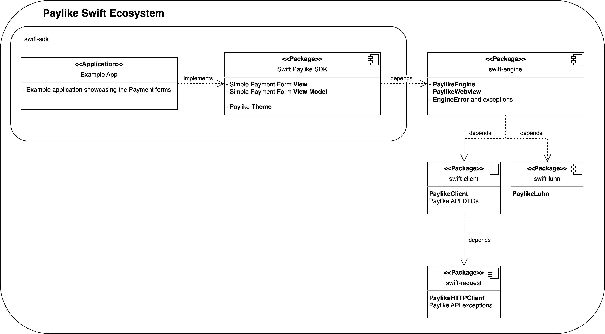

# Paylike's Swift SDK

This library includes the high level components providing complete payment forms to use the Paylike ecosystem.  
If you are looking for our core elements required to implement payment flow towards the API, [check here](https://github.com/paylike/swift-engine).

## Table of Contents
---
- [Paylike's Swift SDK](#paylikes-swift-sdk)
  - [Table of Contents](#table-of-contents)
  - [General Info](#general-info)
    - [Purpose of this library](#purpose-of-this-library)
    - [# Used Technologies, and iOS target](#used-technologies-and-ios-target)
    - [Paylike API Reference](#paylike-api-reference)
    - [Paylike Swift Ecosystem](#paylike-swift-ecosystem)
  - [Usage](#usage)
  - [TL;DR](#tldr)
  - [Forms](#forms)
    - [Simple Paymment Form](#simple-payment-form)
      - [Using Custom Themes](#using-custom-themes)
      - [Extending with additional data](#extending-with-additional-data)
  - [Configurable Closures](#configurable-closures)
    - [onSuccess](#onsuccess)
    - [onError](#onerror)
    - [beforePayment](#beforepayment)
  - [Details](#details)
    - [Localisation](#localisation)
    - [Error Handling](#error-handling)
  - [Example Application](#example-application)

## General Info
---
### Purpose of this library
This library was created to provide the simplest way of integrating Paylike into your iOS application.  
It provides views and viewModels to create a payment form and an easy way to handle the payment result.

### Used Technologies, and iOS target
For the UI related design and implementation the chosen technology is **SwiftUI**.
The minimal target is **iOS 13.0**. It is supported by 96.1% of iOS devices (Last Updated 2023.06.29) 

### Paylike API Reference
For the library you can find the API reference [here](https://paylike.io#todo-link).  
To get more familiar with our server API you can find here the [official documentation](https://github.com/paylike/api-reference).

### Paylike Swift Ecosystem



## Usage
---

To use the ecosystem you must add the package as a dependency to your xcodeproject, or package.

### Add To Project in XCode 14.3.1

* Open your xcodeporj file
* Go to the Package Dependencies tab
* Click the + icon to add a new package
* In the Search bar at the top right enter the package url: `https://github.com/paylike/swift-sdk`

### Add to Package

Package.swift
```swift
// swift-tools-version: 5.6

import PackageDescription

let package = Package(
    // ...
    dependencies: [
        .package(url: "https://github.com/paylike/swift-sdk", .upToNextMajor(from: "0.1.0")),
        // ...
    ],
    // ...
)
```

## TL;DR
---
Don't forget to create your **OWN** API key (merchant ID) for the Paylike ecosystem. See: https://paylike.io/platforms/integration & https://github.com/paylike/api-docs#getting-an-api-key

```swift
import SwiftUI
import Foundation
import PaylikeClient
import PaylikeEngine
import PaylikeSDK

func onSuccess() -> Void {
    print("Success!")
}

@main
struct ExampleApp: App {
    var paylikeViewModel: SimplePaymentFormViewModel

    init() {
        var engine = PaylikeEngine(merchantID: "YOUR_KEY", engineMode: .TEST, loggingMode: .DEBUG) // PaylikeEngine handles the payment flow under the hood. Don't forget to add your own key!
        var amount = PaymentAmount(currency: .EUR, value: 30, exponent: 0)
        
        paylikeViewModel = SimplePaymentFormViewModel(engine: engine, amount: amount, onSuccess: onSuccess)

        // For testing define test data, to simulate a valid card:
         paylikeViewModel.addPaymentTestData(PaymentTest())
    }

    var body: some Scene {
        WindowGroup {
            // Simple Payment Form only asks for card details, and handles the payment flow.
            // Shows errors, loading, WebView for TDS, and a success state
            SimplePaymentForm(viewModel: paylikeViewModel)
                .environmentObject(PaylikeTheme) // PaylikeTheme is required for theming of the components. You can define your own theme if you like
        }
    }
}
```

## Forms
---
### Simple Payment Form
This form provides the simplest implementation of a payment flow.  
**Features**:
* Card number input field (indicating the recognized card issuer; supported cards are Maestro, MasterCard and Visa),
* Expiry date input field,
* Card verification code input field,
* Pay button,
* WebView to help TDS and
* can receive custom theme definition.

Every field has a realtime sanitation and check if its acceptable. Pushing the pay button has a check if every field meets the requirements, if not the button is disabled. If every field exaushted the expected conditions then the payment flow starts, a loading overlay is shown on top of the input fields, and the button becomes disabled. The webView appears when necessary, accepts user input to solve TDS, then disappears. The form shows a success overlay or an error in case the flow is finished. The navigation to and from the form is up to the developer.
A Theme environmentObject has to be defined in order for the views to show properly. You can use the prepared PaylikeTheme for paylike branding, or you can define your own.

SimplePaylikeExampleView.swift
```swift
import SwiftUI
import Foundation
import PaylikeClient
import PaylikeEngine
import PaylikeSDK

class SimpleExampleViewModel: ObservableObject {
    @Published var showSuccessOverlay = false

    func onSuccess() -> Void {
        showSuccessOverlay = true
    }
}

struct SimplePaylikeExample: View {
    @ObservedObject var exampleViewModel: SimpleExampleViewModel
    var paylikeViewModel: SimplePaymentFormViewModel

    init() {
        // Create the exampleViewModel inside the init method, so the closures can be used by paylikeViewModel
        let exampleViewModel = SimpleExampleViewModel()
            
        // Initialization of VM, and including Engine
        var engine = PaylikeEngine(merchantID: "YOUR_KEY", engineMode: .TEST, loggingMode: .DEBUG) // Use your OWN merchant key, highly recommended to store it in obfuscated environmental variable and not hardcode it to codebase. Can be obtained from Paylike. Test mode: ApiMode.TEST
        //  optionally define webView, or use the default Paylike webView, defined in swift-engine.
        
        paylikeViewModel = SimplePaymentFormViewModel(engine: engine, onSuccess: onSuccess)
        
        // Add payment amount, and additionally any other defined data to VM. See: https://github.com/paylike/swift-engine and Paylike API documentation
        var amount = PaymentAmount(currency: .EUR, value: 30, exponent: 0)
        paylikeViewModel.addDescriptionPaymentData(
            //  paymentTestData: PaymentTest(), // Only in test mode
            paymentAmount: amount,
            //  paymentPlanDataList: paymentPlanDto,
            //  paymentUnplannedData: paymentUnplannedDto,
        )
                
        // optionally
        //  paylikeViewModel.addAdditionalPaymentData(
        //      textData: textData,
        //      customData: customData,
        //  )
        
        self.exampleViewModel = exampleViewModel
    }

    var body: some View {
        ZStack {
            // Create the simple payment form
            SimplePaymentForm(viewModel: paylikeViewModel)
                .environmentObject(PaylikeTheme) // PaylikeTheme is required for theming of the components. You can define your own theme if you like
            // The whole form will be covered with this overlay once the payment succesfully finished. This is for showcasing purposes only
            ExampleSuccessOverlay(showOverlay: exampleViewModel.showSuccessOverlay)
        }
        .onDisappear {
            paylikeViewModel.resetViewModelAndEngine() // Reset the VM and engine state after leaving the view, so a new payment can be made
            exampleViewModel.showSuccessOverlay = false
        }
    }
}
```
#### Using Custom Themes

Paylike Swift SDK is built by defining high level components that use the same theme across the board.Components use a `@EnvironmentObject Theme` to set their own colors and sizes. The SDK exports a default Theme called `PaylikeTheme`, which is using the Paylike color scheme. However if you want to add your own branding to the form, you can create your own Theme and pass it on to to the components.

MyTheme.swift
```swift
import SwiftUI
import PaylikeSDK

var CustomTheme: Theme {
    let theme = Theme()
    theme.primaryColor = .blue
    theme.errorColor = .orange
    theme.disabledColor = Color(red: 1, green: 0.2, blue: 0.2)
    return theme
}

// Usage in another file:
    SimplePaymentForm(viewModel: paylikeViewModel)
        .environmentObject(CustomTheme)
```
#### Extending with additional data

Use the `beforePayment` closure to set additional custom data on the Payment, when the Pay Button is pressed. Two kinds of additional data can be added to the payment, both are optional:
* textData: String data
* customData: any Encodable data.

ExtendedPaylikeExample.swift
```swift
import AnyCodable
import SwiftUI
import PaylikeEngine
import PaylikeSDK
import PaylikeClient

/// Encodable custom data
struct CustomData: Encodable {
    var email = "not-real@test.com"
    var testArray = [0, 1, 2]
}

class ExtendedExampleViewModel: ObservableObject {    
    // This data can be edited in the example, and is added to the payment as additional data in the beforePayment callback
    @Published var textData = "this is a test"
    
    @Published var customData = CustomData()
    
    func beforePayment (engine: PaylikeEngine, _: String, _: String, _: CardExpiry, _: String?, _: AnyEncodable?) -> Void {
        // Add the additional data to the engine before the payment is started
        engine.addAdditionalPaymentData(textData: textData, customData: AnyEncodable(customData))
    }
}

struct ExtendedPaylikeExample: View {
    @ObservedObject var exampleViewModel: ExtendedExampleViewModel

    var paylikeViewModel: SimplePaymentFormViewModel
    
    init(engine: PaylikeEngine) {
        // Create the exampleViewModel inside the init method, so the closures can be used by paylikeViewModel
        let exampleViewModel = ExtendedExampleViewModel()
        paylikeViewModel = SimplePaymentFormViewModel(engine: engine, onSuccess: exampleViewModel.onSuccess, beforePayment: exampleViewModel.beforePayment)
        
        paylikeViewModel.addPaymentAmount(PaymentAmount(currency: .EUR, value: 30, exponent: 0))
        paylikeViewModel.addPaymentTestData(PaymentTest()) // Only during testing
        
        self.exampleViewModel = exampleViewModel
    }

    var body: some View {
        VStack(alignment: .leading) {
            Text("ADDITIONAL TEXT DATA")
                .bold()
            TextField<Text>("placeholder", text: $exampleViewModel.textData) // Editing the text field is allowed until the Pay Button is pressed
            SimplePaymentForm(viewModel: paylikeViewModel)
                .environmentObject(PaylikeTheme)
        }
        .onDisappear {
            paylikeViewModel.resetViewModelAndEngine()
        }
    }
}
```

## Configurable Closures

### onSuccess

```swift
public typealias OnSuccessHandler = () -> Void
```

Called when the PaylikeEngine status changes to SUCCESS. Can be set in the PaylikeViewModel initializer. Use this closure for redirection after a successful payment.

### onError

```swift
public typealias OnErrorHandler = (_ error: PaylikeError) -> Void
```

Called when the PaylikeEngine status changes to ERROR. Can be set in the PaylikeViewModel initializer. The Error Object emitted by the Engine will also be passed as a parameter

### beforePayment

```swift
public typealias BeforePayment = (_ engine: PaylikeEngine, // Engine under the hood. see https://github.com/paylike/swift-engine
                                  _ cardNumber: String, // Card Number entered by the user
                                  _ cvc: String, // Card Verification code entered by the user
                                  _ cardExpiry: CardExpiry, // Card Expiry Date entered by the user
                                  _ textData: String?, // TextData already added to the payment repository
                                  _ customData: AnyEncodable? // CustomData already added to the payment repository
                                  ) -> Void
```


Called when the Pay Button has been pressed, and all the Payment Data has been set according to the viewModel, but before payment is started. You can use this callback to modify data on the engine, or to do third party logic. Can be set in the PaylikeViewModel initializer.


## Details
---
### Localisation

Localisation is not supported by the iOS version yet. Help us out!

### Error Handling
For error definitions see: [here](https://github.com/paylike/api-reference/blob/main/status-codes.md)

## Example Application

There is an example application showcasing the usual use-cases in an Example application under [this folder](https://github.com/paylike/swift-sdk/tree/main/Example) of this repository.
